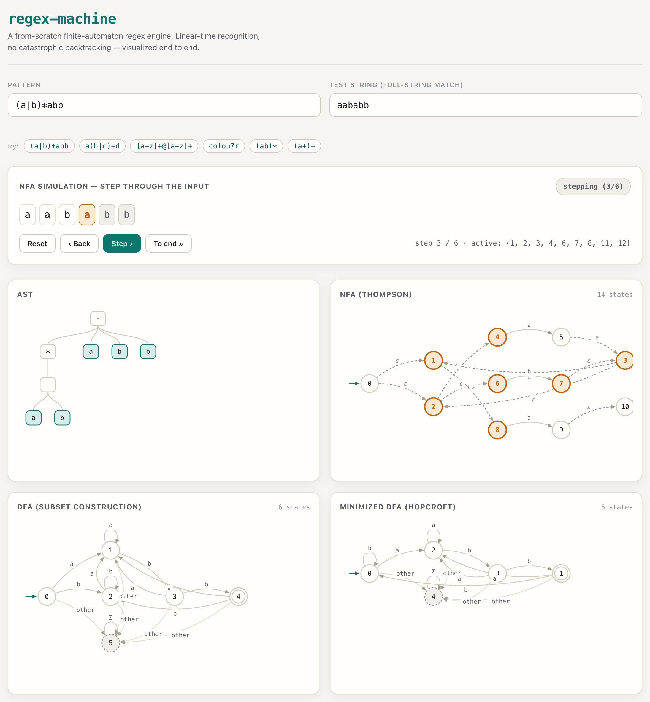
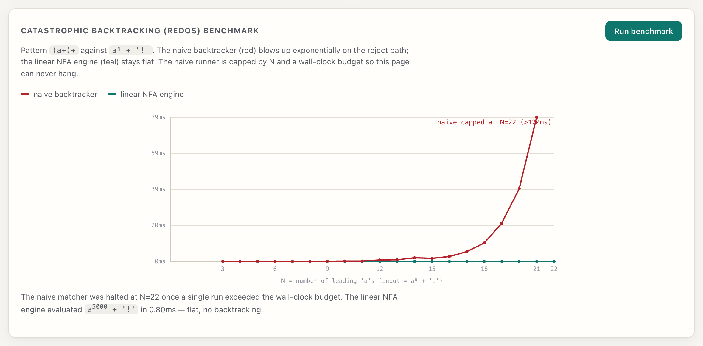
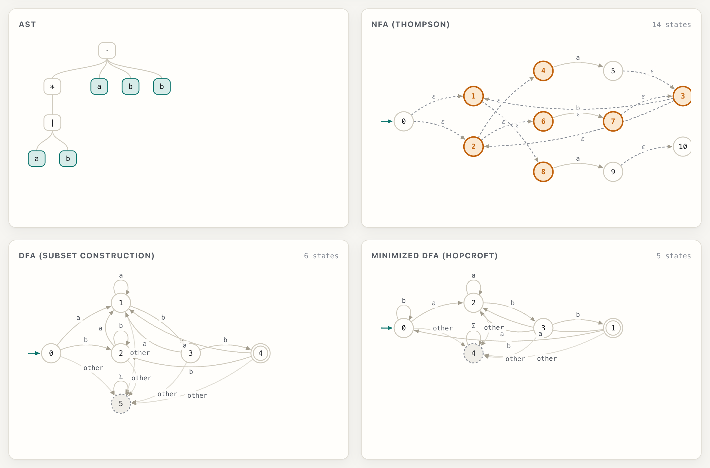
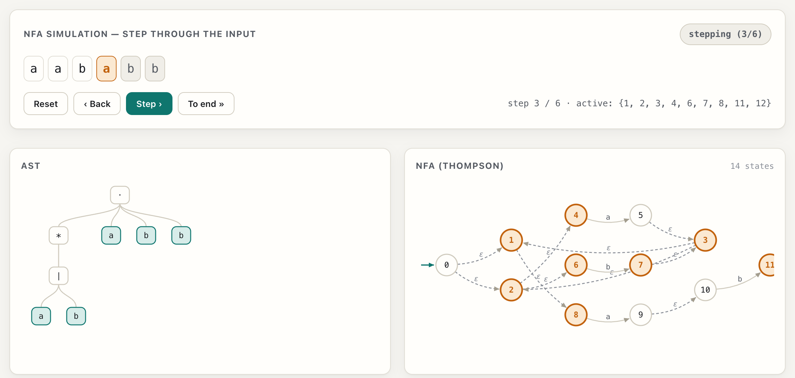

# regex-machine

[](https://github.com/jonathon-lockridge/regex-machine/actions/workflows/ci.yml)
[](LICENSE)
[](tsconfig.json)

A **from-scratch regular-expression engine** written in strict TypeScript — tokenizer → parser → Thompson NFA → subset-construction DFA → Hopcroft-minimized DFA — that recognizes the regular languages in **guaranteed linear time, with no catastrophic backtracking**. It ships with an interactive visualizer that draws all four automata, steps the NFA simulation character by character, and benchmarks a real ReDoS blow-up against the flat linear engine.

### **[▶ Live demo](https://jonathon-lockridge.github.io/regex-machine/)**

> If the demo link 404s, GitHub Pages has not finished its first deploy yet. The URL is deterministic — `https://jonathon-lockridge.github.io/regex-machine/` — and goes live once Pages is enabled (Settings → Pages → Source: GitHub Actions) and the `pages.yml` workflow has run.



---

## Why this exists

A backtracking regex engine (including JavaScript's built-in `RegExp`) can take **exponential time** on adversarial inputs — the classic [ReDoS](https://en.wikipedia.org/wiki/ReDoS). Pattern `(a+)+` against `"aaaaaaaaaaaaaaaaaaaaaaaaa!"` makes V8 explore ~2²⁵ ways to fail.

A true finite-automaton engine cannot do this. It recognizes **exactly** the regular languages by simulating an automaton, tracking a *set* of active states and never backtracking — so recognition is `O(states × input length)`, full stop. `regex-machine` is that engine, built end to end so you can *see* every stage.



The naive backtracker (red) is included only as a **foil** to make the contrast visible. The real engine (teal) *evaluated* `a⁵⁰⁰⁰ + '!'` (a reject) in under a millisecond.

---

## How it works

The pipeline is six cohesive, individually-tested stages under [`src/engine`](src/engine):

| Stage | Module | What it does |
| --- | --- | --- |
| 1. Tokenizer | [`tokenizer.ts`](src/engine/tokenizer.ts) | Pattern string → token stream. Resolves escapes and character-class internals; every single-symbol matcher becomes one `CharSet`. |
| 2. Parser | [`parser.ts`](src/engine/parser.ts) | Tokens → typed AST. Precedence: alternation < concatenation < postfix quantifier < atom. Rejects all malformed patterns the host also rejects. |
| 3. Thompson NFA | [`nfa.ts`](src/engine/nfa.ts) | AST → NFA with ε-transitions (one fresh start/accept per fragment). |
| 4. NFA simulation | [`nfa.ts`](src/engine/nfa.ts) | Linear-time recognition over the active-state set. ε-closure uses a visited set, so nullable loops like `(a*)*` terminate. |
| 5. Subset construction | [`dfa.ts`](src/engine/dfa.ts) | NFA → **total** DFA with an explicit trap state, over an alphabet of code-point equivalence classes. |
| 6. Hopcroft minimization | [`minimize.ts`](src/engine/minimize.ts) | DFA → canonical minimal DFA via partition refinement. |

```ts
import { compile, match } from 'regex-machine';

const re = compile('(a|b)*abb');
re.test('aababb');     // true   — via the minimized DFA (canonical path)
re.testNfa('aababb');  // true   — via the linear NFA simulation
re.ast; re.nfa; re.dfa; re.minDfa;   // every intermediate artifact is exposed

match('a(b|c)+d', 'abccd'); // true
```

`test()` defaults to the **minimized DFA** — the smallest, fastest recognizer. The visualizer's step-through uses the NFA simulation. A cross-automaton test (below) guarantees all four recognizers agree.

The four diagrams, the AST, and the graph layout are all **hand-rolled — no regex library, no graph-layout dependency.**



The visualizer steps the NFA one input character at a time, highlighting the current active state-set and showing consumed vs. remaining input until it lands in a green *accepted* or red *rejected* state:



---

## Supported syntax

| Feature | Syntax | Supported |
| --- | --- | :---: |
| Literal characters | `abc` | ✅ |
| Concatenation | `ab` (adjacency) | ✅ |
| Alternation | `a\|b` | ✅ |
| Quantifiers | `*` `+` `?` | ✅ |
| Grouping | `( … )` | ✅ |
| Character classes | `[abc]`, ranges `[a-z]`, negation `[^…]` | ✅ |
| Dot | `.` | ✅ |
| Anchors | `^` `$` (whole-pattern only) | ✅ |
| Escapes | `\( \) \[ \] \{ \} \. \* \+ \? \| \^ \$ \\ \-`, `\n \t \r` | ✅ |
| Shorthand classes | `\d \w \s \D \W \S` | ✅ |
| **Backreferences** | `(.)\1` | ❌ by design |
| **Lookarounds** | `(?=…)` `(?<=…)` | ❌ by design |

### Why no backreferences or lookarounds?

This is the whole point, not a limitation. A finite automaton recognizes **exactly** the regular languages. Backreferences provably push a language *outside* that class — the canonical `(.*)\1` (a string repeated twice) is not regular and cannot be recognized by any NFA/DFA. Lookarounds are likewise outside the clean automaton model. **Excluding them is precisely what buys the linear-time, no-catastrophic-backtracking guarantee.** An engine that supports them is, necessarily, a backtracking engine.

### Exact semantics (matched to JS `RegExp` without the `u` flag)

The host `RegExp` is the correctness oracle, so the engine matches it byte-for-byte within the supported subset:

- **`.`** matches any UTF-16 code unit **except the four line terminators** `U+000A` (LF), `U+000D` (CR), `U+2028` (LS), `U+2029` (PS).
- **`[^…]`** matches everything *not listed* — and therefore **does** match those four terminators (the deliberate dot-vs-negated-class asymmetry).
- **`\d`** = `[0-9]` · **`\w`** = `[A-Za-z0-9_]` (ASCII only) · **`\s`** = the full JS whitespace + line-terminator set (TAB, LF, VT, FF, CR, SPACE, NBSP, the Unicode space separators, LS, PS, BOM).
- **Anchors** `^`/`$` are accepted only when they anchor the *whole* pattern (matching is already full-string). An interior anchor — inside a group or an alternation branch, e.g. `(^a)`, `a|b$` — is a parse error, as is a stacked quantifier (`a**`), an empty class (`[]`), or a reversed range (`[z-a]`).

Matching is **full-string**: `compile(p).test(s)` is true iff `s` is matched in its entirety (as if wrapped `^(?:p)$`). It returns a boolean — this is a recognizer, not a capture-group extractor.

---

## Self-verification

Correctness is not asserted by a handful of hand-picked cases — it is **fuzzed against the host engine**. See [`test/`](test).

- **Differential fuzzing** ([`fuzz.test.ts`](test/fuzz.test.ts)) — 5000 seeded random patterns from the safely-comparable subset, each run against `new RegExp('^(?:'+p+')$').test(s)`. All randomness comes from a seeded `mulberry32` PRNG, so CI is reproducible run to run and any failure is replayable.
- **Cross-automaton agreement** — for every `(pattern, string)` pair, the linear **NFA simulation**, the **subset DFA**, the **minimized DFA**, and the **naive backtracker** (whenever it finishes within a fixed step budget) must *all* return the same boolean as the oracle. This directly substantiates "the minimal DFA recognizes the same language" and catches subset-construction and Hopcroft bugs cheaply.
- **DFA-minimality invariant** ([`minimize.test.ts`](test/minimize.test.ts)) — `minimize(minimize(D))` has the same state count as `minimize(D)` (idempotence), plus hand-computed minimal-state-count fixtures over a `{a, b}` alphabet.
- **Per-stage unit tests** for the tokenizer, parser (precedence + every parse-error case), NFA, DFA, and minimization, plus a dedicated semantics suite for the exact `.` / `[^…]` / `\d\w\s` / anchor rules.
- **ReDoS is verified deterministically** in CI by a *step-count* proxy (the naive backtracker blows past a fixed operation budget on `(a+)+` while the minimized DFA answers cheaply). Wall-clock timings are demonstrated only in the visualizer, never asserted, so CI is never flaky.

> The fuzzer's generator keeps test strings short and quantifier bodies quantifier-free — not to hide bugs, but because the *host oracle itself* is a backtracking matcher that would ReDoS-hang on adversarial nested quantifiers. A second fuzz block exercises nested quantifiers (`(a*)*`, `(a+)+`, …) for NFA/DFA/min-DFA agreement, which the host cannot evaluate safely.

---

## Run it locally

```bash
npm install      # install dev dependencies (TypeScript, Vite, Vitest)
npm run dev      # start the visualizer at http://localhost:5173
npm test         # run the full test + fuzz suite (Vitest)
npm run typecheck # strict tsc --noEmit
npm run build    # type-check + production build to dist/
```

Requires Node.js ≥ 20. **No API keys, secrets, or environment variables are needed** — this project has none and reads none.

## Project layout

```
src/engine/   tokenizer, parser/ast, nfa, dfa, minimize, backtracker, charset, index (public API)
src/viz/      Vite single-page visualizer (graphs, NFA step-through, ReDoS benchmark)
test/         seeded PRNG, per-stage unit tests, semantics, edge cases, the fuzzer
docs/         screenshots
```

## License

[MIT](LICENSE) © 2026 jonathon-lockridge
